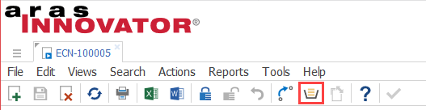
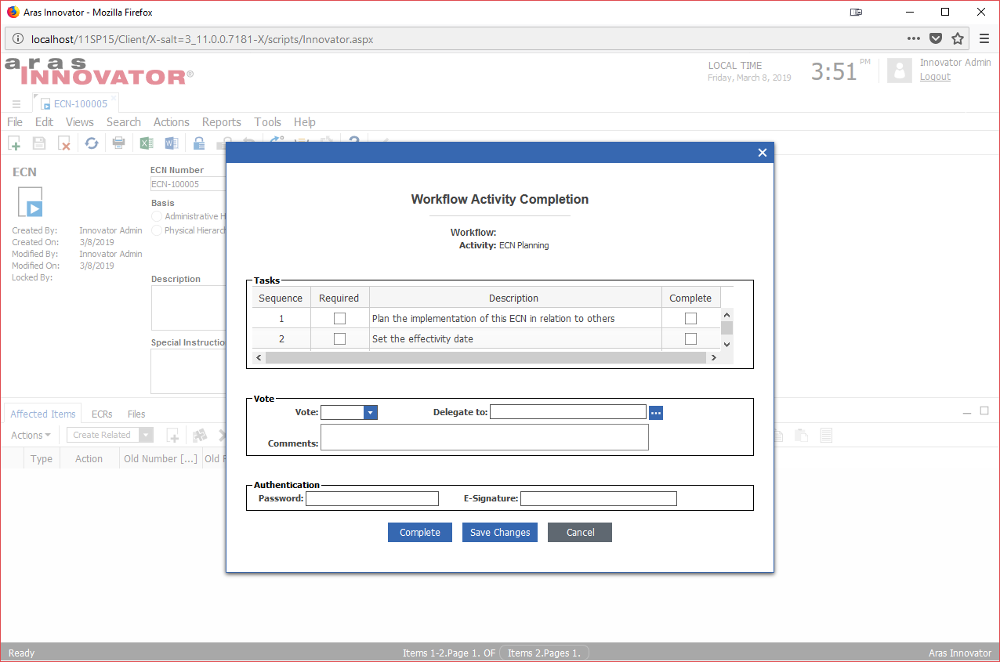

# CUI Button for Voting on Workflow Tasks 

This project adds a "Workflow Vote" CUI button to the Aras item window toolbar. The button allows the user to select a Workflow Task assigned to their InBasket and submit a vote without navigating away from the item form.

## History

Release | Notes
--------|--------
[v1.0.0](https://github.com/ArasLabs/cui-workflow-vote/releases/tag/v1.0.0) | First release. Tested on Aras 11 SP15. 

#### Supported Aras Versions

Project | Aras
--------|------
[v1.0.0](https://github.com/ArasLabs/cui-workflow-vote/releases/tag/v1.0.0) | 11.0 SP15 

## Installation

#### Important!
**Always back up your code tree and database before applying an import package or code tree patch!**

### Pre-requisites

1. Aras Innovator installed
2. Aras Package Import Utility
3. aras.labs.cui.workflow_vote package

### Install Steps

1. Backup your database and store the BAK file in a safe place.
2. Open up the Aras Package Import tool.
3. Enter your login credentials and click **Login**
    * _Note: You must login as root for the package import to succeed!_
4. Enter the package name in the TargetRelease field.
    * Optional: Enter a description in the Description field.
5. Enter the path to your local `..\cui-workflow-vote\Import\imports.mf` file in the Manifest File field.
6. Select the following in the Available for Import field.
    * **aras.labs.cui.workflow_vote**
7. Select Type = **Merge** and Mode = **Thorough Mode**.
8. Click **Import** in the top left corner.
9. Close the Aras Package Import tool.

You are now ready to login to Aras and begin using the Workflow Vote toolbar button.

## Usage

1. In Innovator, open an item you'd like to view and vote on.
2. In the toolbar, click the Workflow Vote button (it's the InBasket Task icon, next to the Promote button).

3. In the search dialog that appears, double click the InBasket Task you want to vote on. 
4. When the Workflow Task Vote dialog appears, complete your vote as you would from My InBasket.

When your vote is submitted, the item form will automatically update to reflect the vote.

>Note: The Workflow Vote button will only appear active for items that are not locked, and whose ItemType has an associated Workflow Map.

## Contributing

1. Fork it!
2. Create your feature branch: `git checkout -b my-new-feature`
3. Commit your changes: `git commit -am 'Add some feature'`
4. Push to the branch: `git push origin my-new-feature`
5. Submit a pull request

For more information on contributing to this project, another Aras Labs project, or any Aras Community project, shoot us an email at araslabs@aras.com.

## Credits

Created by Eli Donahue for Aras Labs. @EliJDonahue

## License

Aras Labs projects are published to Github under the MIT license. See the [LICENSE file](./LICENSE.md) for license rights and limitations.)